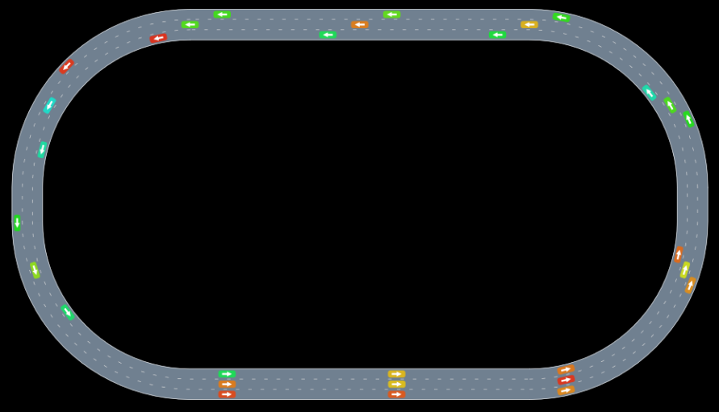

# AutoViz

[](https://travis-ci.org/sisl/AutoViz.jl)
[](https://coveralls.io/r/sisl/AutoViz.jl)

A package for rendering simple scenes primarily consisting of cars on roadways using Cairo.

AutoViz is undergoing significant changes. If you are looking for the version before these changes that is designed around AutomotiveDrivingModels.jl, please checkout the v0.6.0 tag.



## Usage

The main function is

```julia
render(scene)
```

where scene is an iterable of renderable objects including cars and roadways.

Example:
```julia
roadway = gen_straight_roadway(3, 100.0)
car = ArrowCar([0.0, 0.0], 0.0, color=colorant"blue") # [north, east], angle
render([roadway, car, "some text"])
```

In a jupyter notebook, an image will appear, otherwise see the [Saving images](#saving-images) section below. A short tutorial is located in [notebooks/tutorial.ipynb](notebooks/tutorial.ipynb).

## Renderable

*What does it mean to be "renderable"?*

An object is *directly renderable* if the function `render!(rm::RenderModel, object)` is implemented for it.

An object is *renderable by conversion* if `convert(Renderable, object)` returns a directly renderable object.

When `render()` is invoked, direct renderability is checked with `isrenderable(object)`, which defaults to `method_exists(render!, Tuple{RenderModel, typeof(object)})`. If this check fails, a conversion attempt is made with `convert(Renderable, object)`.

### Roadways and ArrowCars

The primary basic directly renderable types are `Roadway` (now from `AutomotiveDrivingModels`; soon from `Roadways.jl`) and `ArrowCar`.

`ArrowCar`s are the pink cars with arrows that are in everyone's videos. You can construct one like this:

```julia
using Colors
using AutoViz

# x, y, angle and velocity are from your simulation

ArrowCar(x, y, angle; color=colorant"green", text="v: $velocity")
```

### How to make types renderable

There are two ways to make renderable types.

1. You can make your existing types renderable by conversion by defining `convert(::Type{Renderable}, ::MyType)` which should return a directly renderable object, e.g. an `ArrowCar`.
2. You can make types directly renderable by defining `render!(::RenderModel, ::MyType)`. To make things easier for the compiler, you can also define `isrenderable(::Type{MyType}) = true`. If you want to allow others to convert to this type to make their types renderable by conversion, make your type a subtype of `Renderable`.

## Overlays

Overlays will function as in the previous version of AutoViz. They will be rendered last with `render!(rendermodel, overlay, scene)`.

## Additional keyword arguments for `render()`

The following additional keyword arguments will accepted by `render()`:

- `canvas_width`
- `canvas_height`
- `rendermodel`
- `overlays`
- `cam` - a camera controlling the field of view as in the previous version of AutoViz

## Saving images

Png images can be saved with `write_to_png(render(scene), "filename.png")`. Gif animations may be created with e.g. [Reel.jl](https://github.com/shashi/Reel.jl).

## `RenderModel`s

The mid-level interface for this package (which is what you will use when you write `render!()` for your types or when you write an overlay) revolves around adding instructions to a `RenderModel`. Each instruction consists of a function and a tuple of arguments for the function. This is not documented in this readme, but it is fairly easy to figure out by reading `rendermodels.jl`, `overlays.jl`, and `arrowcar.jl`.
